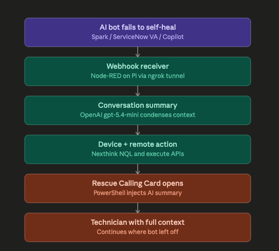

# AI Bot → Rescue Escalation

> A reference integration that turns any AI chatbot into a context-preserving fallback for GoTo Rescue remote sessions.
>
> **Bot fails self-heal → AI summarizes the conversation → Rescue technician picks up with full context, not "hi, what's going on?"**



## Why this exists

Most enterprises in 2026 have invested in AI chatbots for L0 IT support (ServiceNow Virtual Agent, Nexthink Spark, Microsoft Copilot, internal LLMs). These bots resolve a lot of tickets, but when they can't, the handoff to a human is usually painful — the user re-explains everything, the technician restarts troubleshooting from zero, and the context the AI built up gets lost.

This project closes that gap. When the bot escalates, the conversation gets summarized by an AI and handed to the Rescue technician *before* the session starts. The tech reads the summary, knows what's already been ruled out, and walks into the session at the next useful step.

Built as a working reference for the **Nexthink Spark + GoTo Rescue** integration, but the orchestration layer is **bot-agnostic** — swap Spark for any chatbot that can POST a webhook, and the same flow works.

## What it does, end to end

1. User chats with the AI bot about an issue
2. Bot tries to self-heal — automated actions, KB lookups, troubleshooting steps
3. Self-heal fails; bot POSTs an escalation webhook to this integration
4. Node-RED orchestrator receives the webhook and:
   - Acks immediately so the bot can tell the user "ticket raised"
   - Sends the conversation (description + work notes) to OpenAI for summarization (≤500 chars)
   - Resolves the device name to a Nexthink UUID via NQL
   - Triggers a Nexthink remote action with the AI summary as a parameter
5. PowerShell runs on the endpoint:
   - Writes the AI summary to a CField on the Rescue Calling Card
   - Launches the Calling Card silently
6. User clicks the Calling Card → Rescue session starts
7. Technician sees the AI summary as "Reason for reaching out" before connecting
8. Rescue's native post-session AI summary can be pushed back to the ticketing tool, closing the loop

## Demo

A 2-minute walkthrough showing a real failure mode (corporate-blocked internal portal) being handled end-to-end:

📹 [Watch the demo](docs/demo-video-link.mp4) *(replace with your video link)*

| Stage | What the user sees |
|---|---|
| Bot conversation | Spark tries cache clear, DNS flush, browser switch — all fail |
| Escalation | Spark hands off; calling card appears on user's screen |
| Technician view | "Reason for reaching out" pre-populated with AI summary |
| Fix | Tech runs a Zscaler policy update; user refreshes browser; site loads |

## Architecture

The orchestrator sits between the bot and Rescue. It's stateless, uses no database, and runs on commodity hardware (the reference setup is a Raspberry Pi).

```
AI Bot Escalation
       │
       ▼
Node-RED Webhook Receiver  ────►  OpenAI (summarize)
       │
       ▼
Nexthink NQL (resolve device UUID)
       │
       ▼
Nexthink Remote Action (trigger PowerShell on endpoint)
       │
       ▼
Rescue Calling Card (with AI summary in CField)
       │
       ▼
Rescue Technician with full context
```

See [`ARCHITECTURE.md`](ARCHITECTURE.md) for the detailed walkthrough including data shapes, error handling, and the fallback behaviors.

## Repo layout

```
├── README.md                    ← you are here
├── ARCHITECTURE.md              ← detailed technical walkthrough
├── docs/
│   ├── architecture-diagram.png
│   └── screenshots/
├── node-red/
│   ├── flow.json                ← importable Node-RED flow
│   └── README.md                ← setup instructions
├── powershell/
│   ├── Launch-RescueCallingCard.ps1
│   └── README.md
├── demo/
│   ├── Set-DemoState.ps1                 ← block/unblock demo domain via hosts file
│   ├── Sample-ZscalerPolicySimulator.ps1 ← fake Zscaler tool for demo (see notes)
│   └── README.md
├── .env.example                 ← template of required env vars
└── LICENSE
```

## Quick start

You'll need:

- A Raspberry Pi (or any Linux host) with Node-RED installed
- An ngrok account for the public webhook URL (or your own publicly addressable host)
- A Nexthink tenant with API access
- An OpenAI API key (or your organization's LLM gateway)
- A GoTo Rescue account with a Calling Card configured

Setup steps:

1. **Clone this repo** to your Node-RED host
   ```bash
   git clone https://github.com/<you>/ai-bot-to-rescue.git
   cd ai-bot-to-rescue
   ```

2. **Copy `.env.example` to `.env`** and fill in your credentials. See [Node-RED setup](node-red/README.md) for which env vars Node-RED expects.

3. **Import the flow** — in Node-RED, top-right menu → Import → paste `node-red/flow.json` → Deploy

4. **Configure Nexthink** — create the saved NQL query for device-name → UUID lookup, configure the connector credential and API call. See [`docs/nexthink-setup.md`](docs/nexthink-setup.md).

5. **Configure your bot** — point its escalation webhook at `https://<your-public-url>/nexthink/rescue`

6. **Test** — `curl -X POST` a sample payload (see [`docs/sample-payloads.md`](docs/sample-payloads.md)) and watch the debug sidebar in Node-RED.

## Phase history

This is Phase 2 of an internal integration project.

- **Phase 1** (2025): Rescue reachable from Spark on specific KBs. Each new failure scenario required a new KB authored explicitly to trigger the escalation.
- **Phase 2** (2026): Rescue as the default fallback for *any* failed bot self-heal, with AI-summarized context preserved through the handoff. Bot-agnostic.

## What this is and isn't

**This is:** a working reference implementation. It's running successfully end-to-end on commodity hardware. You can clone it, plug in your credentials, and have a working integration in an afternoon.

**This isn't:** a production-hardened product. Before deploying for real:

- Move secrets to a proper vault, not env vars on a Pi
- Move the AI call to your organization's approved LLM gateway, especially for regulated industries
- Move the Node-RED instance off the Pi to a real cloud host with monitoring
- Add proper error alerting (the catch node here goes to debug; in prod it should page someone)
- Add an authentication step on the webhook receiver

## Built with

- [Node-RED](https://nodered.org/) — flow-based orchestration
- [ngrok](https://ngrok.com/) — webhook tunneling (POC only)
- [OpenAI Responses API](https://platform.openai.com/docs/api-reference/responses) — conversation summarization
- [Nexthink NQL + Remote Actions](https://docs.nexthink.com/) — device resolution and endpoint orchestration
- [GoTo Rescue Calling Card](https://www.goto.com/rescue) — the human-side remote support session
- PowerShell on the endpoint side

## Acknowledgements

Built as a personal project at GoTo with thanks to Daniel for the OpenAI guidance and the wider Solution Consulting team for testing scenarios.

## License

MIT — see [`LICENSE`](LICENSE). Use it, adapt it, ship it. Attribution appreciated but not required.

## Contact

If you're working on a similar integration or want to discuss adapting this for a different chatbot, open an issue or reach out.
